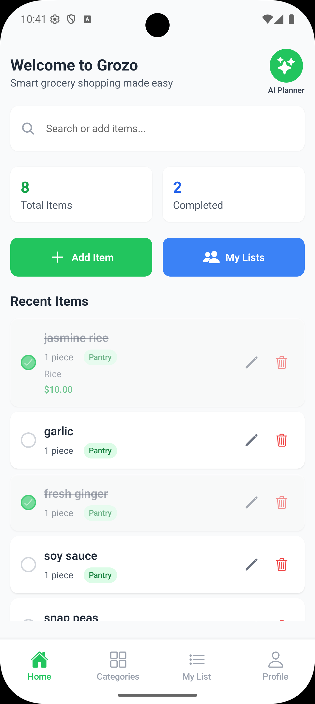
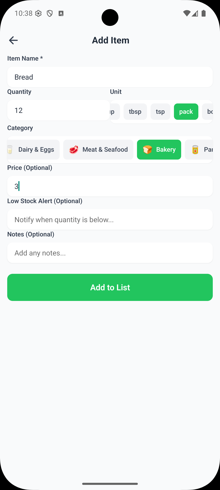
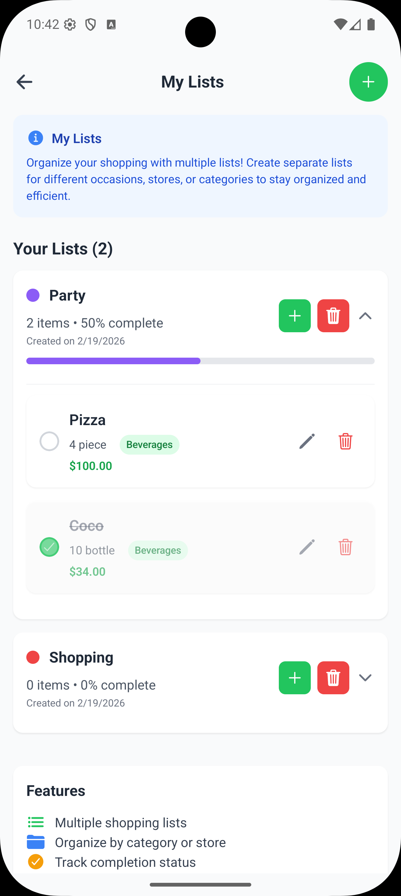
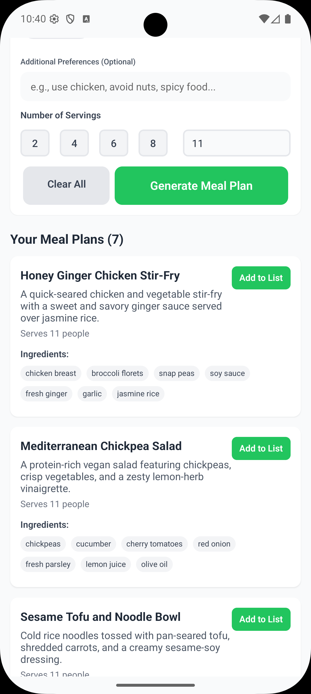
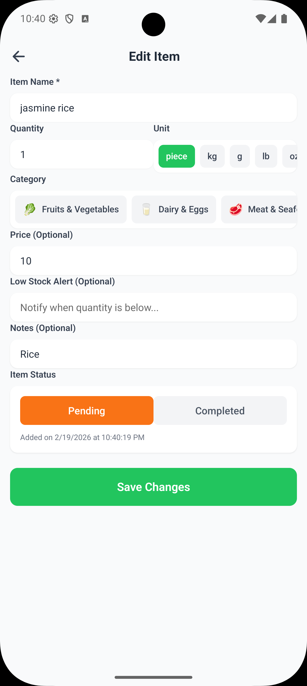
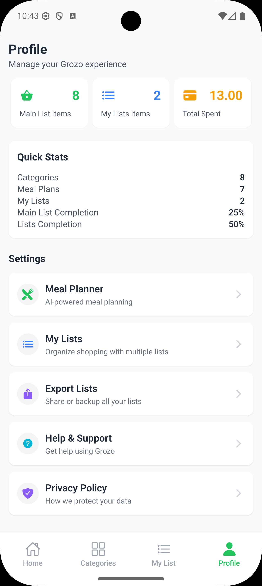
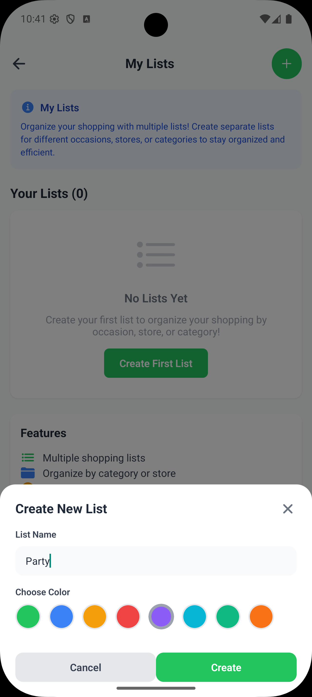
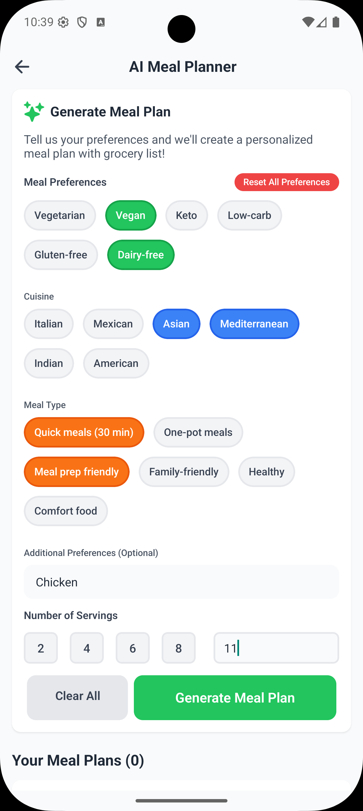

# Grozo - Smart Grocery List

**Transform your grocery shopping experience with AI-powered intelligence**

Grozo is a modern mobile app that makes grocery shopping effortless and organized. Built with React Native and powered by AI, it helps you create smart shopping lists, plan meals, and coordinate with family members.

<div align="center">
  
</div>

## Why Choose Grozo?

**AI-Powered Intelligence** - Get smart suggestions and auto-generated meal plans  
**Simple & Intuitive** - Clean design that anyone can use  
**Family Friendly** - Share lists and coordinate shopping with family  
**Never Forget** - Smart reminders for low stock and shopping trips  
**Stay Organized** - Category-based organization with progress tracking  

## App Screenshots

<div align="center">

| Home Screen | Add Items | My Lists | AI Meal Planner |
|-------------|-----------|----------|-----------------|
|  |  |  |  |

| Edit Items | Profile | New List | AI Features |
|------------|---------|----------|-------------|
|  |  |  |  |

</div>

## Key Features

### Smart Shopping Lists
- **Easy Item Management** - Add, edit, and delete items with a few taps
- **Quantity Control** - Select quantities with multiple unit options
- **Category Organization** - Items automatically sorted into 8 categories
- **Progress Tracking** - See your shopping completion status

### AI-Powered Features
- **Smart Suggestions** - AI recommends items based on your shopping patterns
- **Meal Planning** - Generate weekly meal plans with automatic grocery lists
- **Auto-Categorization** - Items are automatically placed in the right categories
- **Shopping Tips** - Get personalized advice to save money

### Family Coordination
- **Shared Lists** - Create and share grocery lists with family members
- **Real-time Updates** - Everyone sees changes instantly
- **Multiple Lists** - Manage different lists for different occasions

### Smart Reminders
- **Low Stock Alerts** - Get notified when items are running low
- **Shopping Reminders** - Never forget your grocery trips
- **Meal Planning Reminders** - Weekly prompts to plan your meals

## Getting Started

### Download & Install

**For Developers:**
1. **Prerequisites**
   - Node.js (version 16 or higher)
   - Expo CLI: `npm install -g @expo/cli`
   - iOS Simulator or Android Studio for testing

2. **Quick Setup**
   ```bash
   # Clone the project
   git clone https://github.com/chetanck03/grozo.git
   cd grozo
   
   # Install dependencies
   npm install
   
   # Start the app
   npm start
   ```

3. **Run on Your Device**
   - Download **Expo Go** from App Store or Google Play
   - Scan the QR code that appears in your terminal
   - The app will load on your phone instantly!

### AI Setup (Optional)
To enable AI features, you'll need a Gemini API key:
1. Get your free API key from [Google AI Studio](https://makersuite.google.com/app/apikey)
2. Add it to `src/services/geminiService.ts`
3. Enjoy AI-powered suggestions and meal planning!

## How to Use Grozo

### 1. **Create Your First List**
- Open the app and tap the "+" button
- Add items by typing or using AI suggestions
- Select quantities and categories automatically

### 2. **Smart Shopping**
- Items are organized by categories (Fruits, Vegetables, Dairy, etc.)
- Check off items as you shop
- Track your progress with the completion bar

### 3. **AI Meal Planning**
- Go to the AI Meal Planner tab
- Let AI create a weekly meal plan for you
- Automatically generate shopping lists from meal plans

### 4. **Family Coordination**
- Create shared family lists
- Everyone can add items and see updates
- Perfect for coordinating household shopping

## Technical Details

### Built With
- **React Native & Expo** - Cross-platform mobile development
- **TypeScript** - Type-safe code for better reliability
- **Zustand** - Simple and efficient state management
- **Tailwind CSS** - Modern styling with NativeWind
- **Gemini AI** - Intelligent suggestions and meal planning

### App Architecture
```
Grozo App
├── Home Screen - Category overview and quick actions
├── My Lists - Manage your grocery lists
├── AI Planner - Meal planning and suggestions
└── Profile - Settings and family lists
```

## License

This project is licensed under the MIT License - see the [LICENSE](LICENSE) file for details.

## Support & Community

### Need Help?
- **Email Support**: Contact our team for assistance
- **Documentation**: Check our detailed guides
- **Report Issues**: Found a bug? Let us know!
- **Feature Requests**: Suggest new features

### Contributing
We welcome contributions! Here's how you can help:
1. Fork the repository
2. Create a feature branch
3. Make your changes
4. Submit a pull request

### Stay Connected
- **Star this repository** if you find it helpful
- **Share with friends** who love organized shopping
- **Follow updates** for new features

## App Information

- **Version**: 1.0.0
- **Platform**: iOS & Android
- **Framework**: React Native with Expo
- **AI Provider**: Google Gemini
- **License**: MIT License
- **Repository**: https://github.com/chetanck03/grozo

---

<div align="center">

**Grozo - Making grocery shopping smarter, one list at a time!**

*Built with care for organized shoppers everywhere*

[Back to Top](#grozo---smart-grocery-list)

</div>